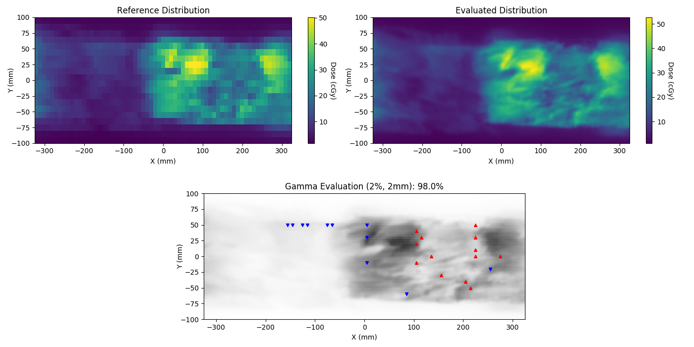
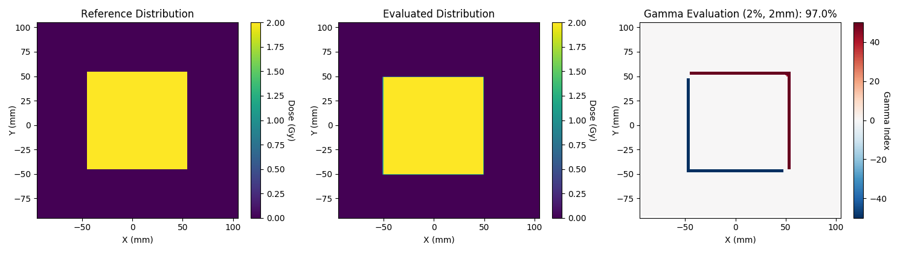
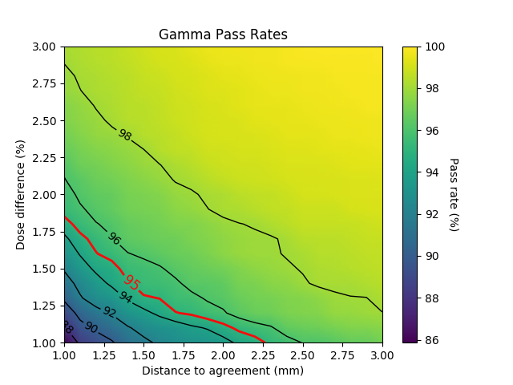

# flashgamma

A python package for speedy analyses of 2D radiotherapy dose distributions.

## Installation

Installation is through `pip`. You must have `numpy` installed in your environment first. You may also wish to install matplotlib to run the examples.

    pip install numpy matplotlib
    pip install flashgamma

## Examples

Checkout the examples folder for details.

**Example 1** demonstrates how to perform a gamma analysis on some ArcCheck data:

**Example 2** uses arbitrary `numpy` arrays:

**Example 3** uses a `cython` based function to rapidly calculate gamma pass rates. That means you can analyse entire ranges of dose difference and distance to agreement criteria at once, generating interesting plots like this:

## Caveats

This code was written for personal educational purposes. Although it was shown internally to perform similarly to a range of proprietary gamma analysis codes, it is in no way guaranteed to be free from bugs and errors.
